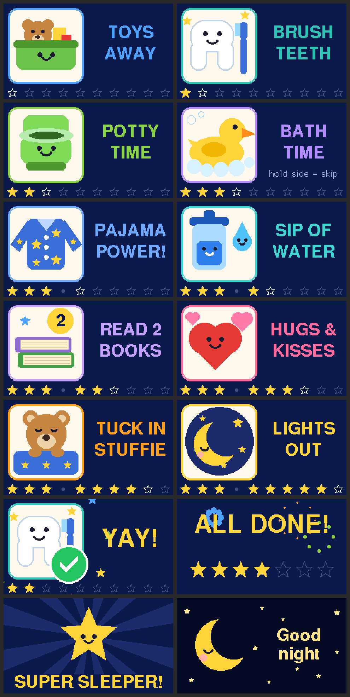

# Toddler Toolkit (M5StickC Plus / Plus2)

Little apps for a 3-year-old on an M5StickC Plus. Each app uses one big
button and gives instant feedback. Pictures replace words, and there is
no way to "lose".

## Mode 1: Bedtime Adventure

A picture checklist for getting ready for bed, based on our bedtime chart:

1. Toys away
2. Brush teeth
3. Potty time
4. Bath time (skip it on non-bath nights)
5. Pajama power!
6. Sip of water
7. Read 2 books
8. Hugs & kisses
9. Tuck in stuffie
10. Lights out



**For the kid:** press the **big front button (A)** after finishing a step.
The picture hops, a green tick pops up, stars fly out and a little tune
plays, then the next step appears. Stars along the bottom show how far
along you are.

When every step is done, fireworks show "ALL DONE!" and tonight's star is
added to the **weekly star chart**. The 7th star unlocks a
**SUPER SLEEPER!** celebration. Then a sleepy moon plays a soft lullaby,
the screen fades out, and the device goes to sleep.

**For grown-ups (side button B):**

| Side button | Does |
|---|---|
| tap | go back one step (oops, pressed too early) |
| hold ~1 s | skip this step, e.g. no bath tonight |
| hold ~3 s | start the whole routine over |

Other behavior:
- After 3 minutes without a press, the device goes to deep sleep. Press A
  to wake it; the routine picks up where it left off. The wake-up press
  doesn't count as finishing a step.
- A half-finished routine is forgotten after 3 hours, so tomorrow night
  starts fresh.
- The weekly star count is stored in flash, so it survives turning the
  device off. It counts *finished nights*, not calendar days.

## Building and flashing

Install [PlatformIO](https://platformio.org/install) (the VS Code extension
or `pip install platformio`), plug in the StickC over USB, then run:

```sh
pio run -t upload          # build and flash
pio device monitor         # optional: serial log
```

The same firmware works on the **StickC Plus** and the **StickC Plus2**.
M5Unified detects the model at runtime.

### Try it on your computer first

With SDL2 installed (`brew install sdl2` or `sudo apt install libsdl2-dev`):

```sh
pio run -e native_sim -t exec
```

Keys: **←** = big button A, **↓** = side button B, **↑** = power.

### Unit tests

```sh
pio test -e native
```

## Tweaking

- `src/Config.h` sets brightness, volume, the idle-sleep time and screen
  rotation. If the picture is upside down, change `kScreenRotation` from
  3 to 1.
- The steps are listed in `kSteps` at the top of
  `src/modes/BedtimeMode.cpp`. Add, remove or reorder them there (up to
  13). Each step has two short title lines, an icon function, an accent
  colour and an optional small hint.
- The icons are drawn from simple shapes in `src/Draw.cpp`, so there are
  no image files to manage.

## Adding another mode

1. Subclass `Mode` (`src/Mode.h`), implementing `enter()` and
   `update(canvas, now)`.
2. Add an instance to `kModes` in `src/main.cpp`.

Once there is more than one mode, a short press of the **power button**
switches between them.

## Layout

```
lib/Checklist/   hardware-free checklist + star-chart logic (unit tested)
src/main.cpp     loop, frame buffer, mode switching, deep sleep
src/Platform.h   shims so the code also builds for the SDL simulator
src/Sound.h      non-blocking buzzer melody player
src/Draw.*       star/tick helpers and all the picture icons
src/modes/       one file pair per toddler mode
test/            host unit tests
```

## Safety

The StickC is small and has a lithium battery inside. Put it in a silicone
case or on a lanyard, and use it with a grown-up around.
